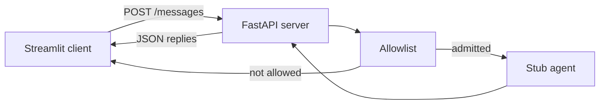

# WhatsApp-like agent mock

Small client/server demo. The **server terminal** prints what the backend sees. **Streamlit** is the user.



## Run

Two processes: start the server first, then the client.

**Step 1 — server** (this terminal prints `[server] received` / `[server] sending`)

```bash
uv sync
uv run uvicorn project_message.app:app --reload --port 8765
```

Leave that running.

**Step 2 — client** (new terminal; this is the user)

```bash
uv run streamlit run streamlit_app.py
```

Open [http://127.0.0.1:8501](http://127.0.0.1:8501). Keep **Server** set to `http://127.0.0.1:8765`.

## Try

- Send as `+15551234567`. Streamlit shows the reply; the server terminal prints received/sending.
- `/help` and `/status`
- Change **My number** and send — Streamlit shows an allowlist denial; the server terminal prints `denied`.
